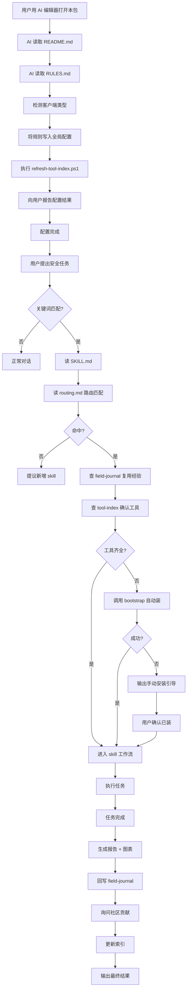
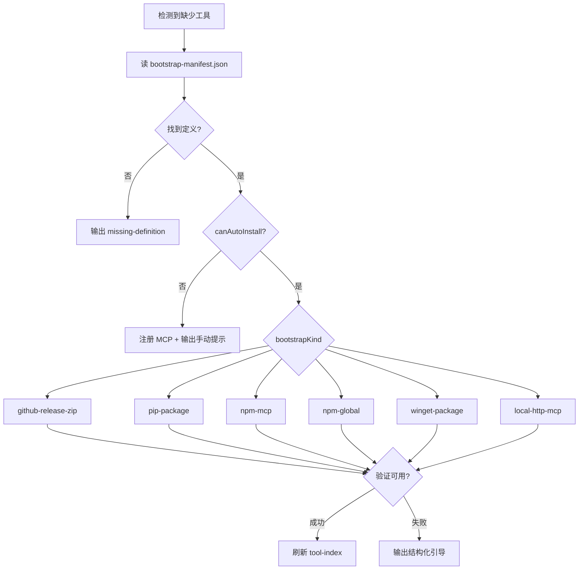
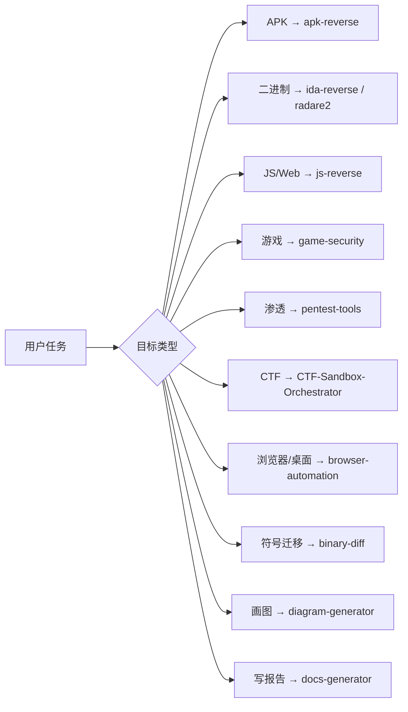
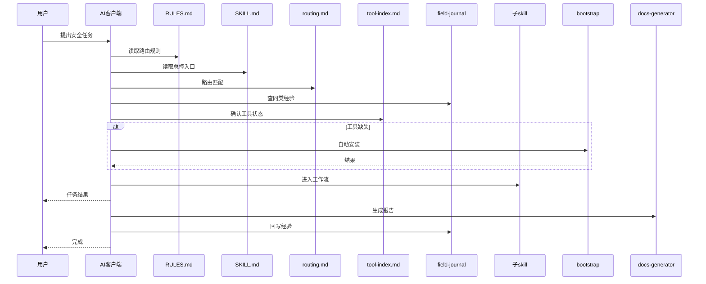

# 系统工作流程全景图

## 1. 完整生命周期

```mermaid
flowchart TD
    A[用户用 AI 编辑器打开本包] --> B[AI 读取 README.md]
    B --> C[AI 读取 RULES.md]
    C --> D[检测客户端类型]
    D --> E[将规则写入全局配置]
    E --> F[执行 refresh-tool-index.ps1]
    F --> G[向用户报告配置结果]
    G --> H[配置完成]

    H --> I[用户提出安全任务]
    I --> J{关键词匹配?}
    J -->|否| K[正常对话]
    J -->|是| L[读 SKILL.md]
    L --> M[读 routing.md 路由匹配]
    M --> N{命中?}
    N -->|否| O[提议新增 skill]
    N -->|是| P[查 field-journal 复用经验]
    P --> Q[查 tool-index 确认工具]
    Q --> R{工具齐全?}
    R -->|是| S[进入 skill 工作流]
    R -->|否| T[调用 bootstrap 自动装]
    T --> U{成功?}
    U -->|是| S
    U -->|否| V[输出手动安装引导]
    V --> W[用户确认已装]
    W --> S

    S --> X[执行任务]
    X --> Y[任务完成]
    Y --> Z[生成报告 + 图表]
    Z --> AA[回写 field-journal]
    AA --> AB[询问社区贡献]
    AB --> AC[更新索引]
    AC --> AD[输出最终结果]
```

## 2. Bootstrap 子流程

```mermaid
flowchart TD
    A[检测到缺少工具] --> B[读 bootstrap-manifest.json]
    B --> C{找到定义?}
    C -->|否| D[输出 missing-definition]
    C -->|是| E{canAutoInstall?}
    E -->|否| F[注册 MCP + 输出手动提示]
    E -->|是| G{bootstrapKind}
    G --> H[github-release-zip]
    G --> I[pip-package]
    G --> J[npm-mcp]
    G --> K[npm-global]
    G --> L[winget-package]
    G --> M[local-http-mcp]
    H & I & J & K & L & M --> N{验证可用?}
    N -->|成功| O[刷新 tool-index]
    N -->|失败| P[输出结构化引导]
```

## 3. 路由决策树

```mermaid
flowchart LR
    A[用户任务] --> B{目标类型}
    B --> C[APK → apk-reverse]
    B --> D[二进制 → ida-reverse / radare2]
    B --> E[JS/Web → js-reverse]
    B --> F[游戏 → game-security]
    B --> G[渗透 → pentest-tools]
    B --> H[CTF → CTF-Sandbox-Orchestrator]
    B --> I[浏览器/桌面 → browser-automation]
    B --> J[符号迁移 → binary-diff]
    B --> K[画图 → diagram-generator]
    B --> L[写报告 → docs-generator]
```

## 4. 文件读取时序

```mermaid
sequenceDiagram
    participant U as 用户
    participant AI as AI客户端
    participant R as RULES.md
    participant SK as SKILL.md
    participant RT as routing.md
    participant TI as tool-index.md
    participant FJ as field-journal
    participant SUB as 子skill
    participant BS as bootstrap
    participant DOC as docs-generator

    U->>AI: 提出安全任务
    AI->>R: 读取路由规则
    AI->>SK: 读取总控入口
    AI->>RT: 路由匹配
    AI->>FJ: 查同类经验
    AI->>TI: 确认工具状态
    alt 工具缺失
        AI->>BS: 自动安装
        BS-->>AI: 结果
    end
    AI->>SUB: 进入工作流
    AI-->>U: 任务结果
    AI->>DOC: 生成报告
    AI->>FJ: 回写经验
    AI-->>U: 完成
```
